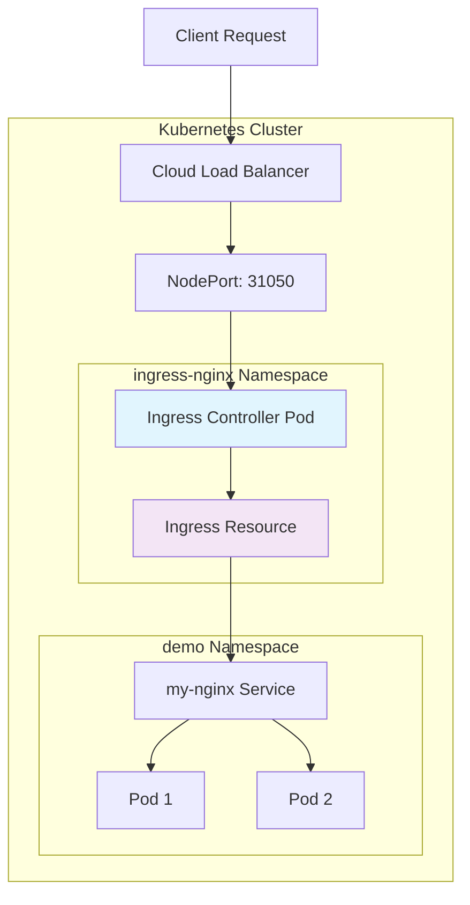
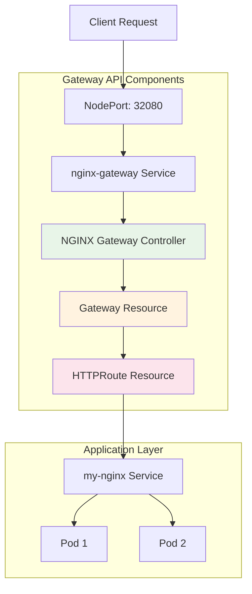
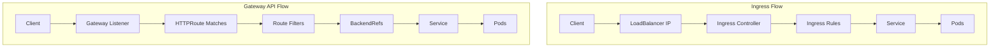
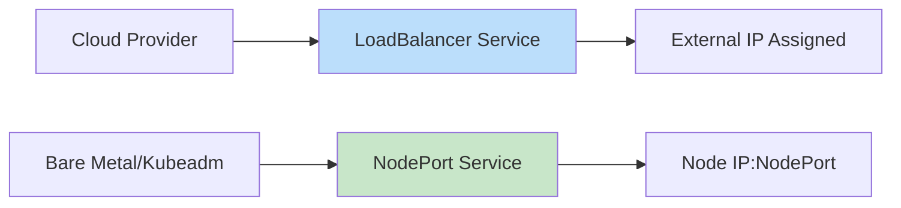
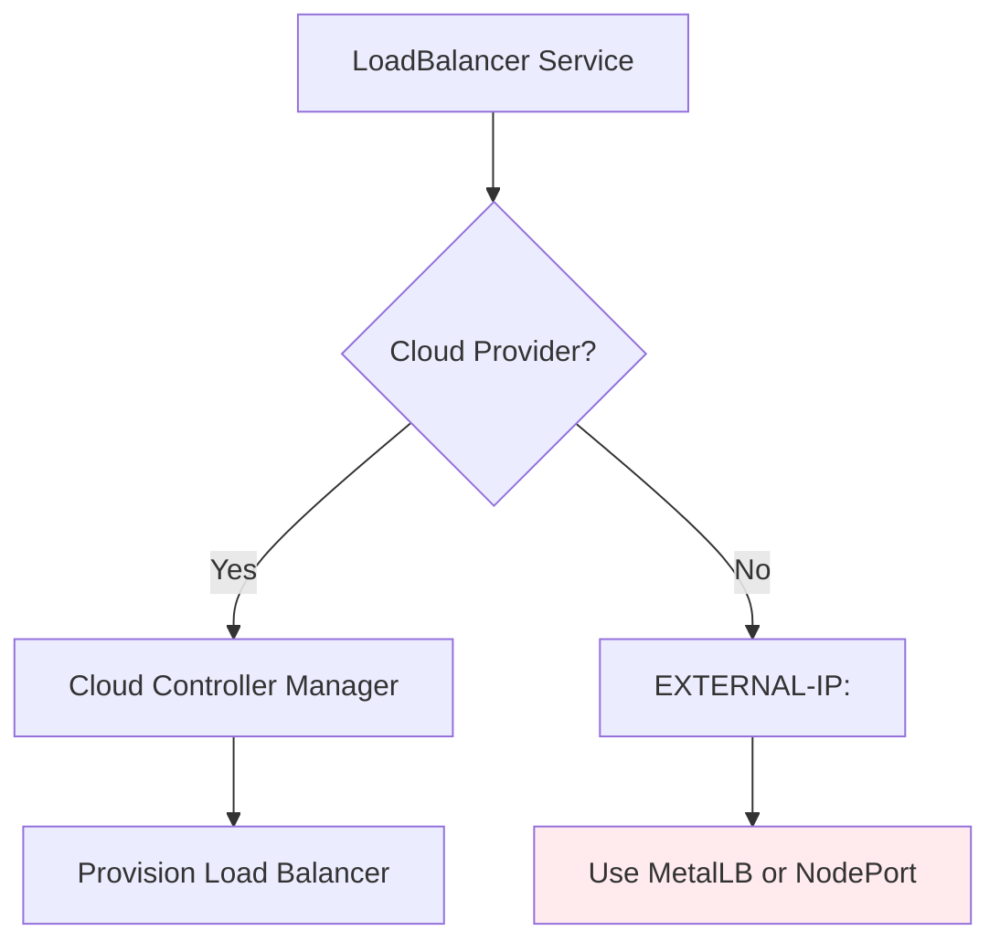
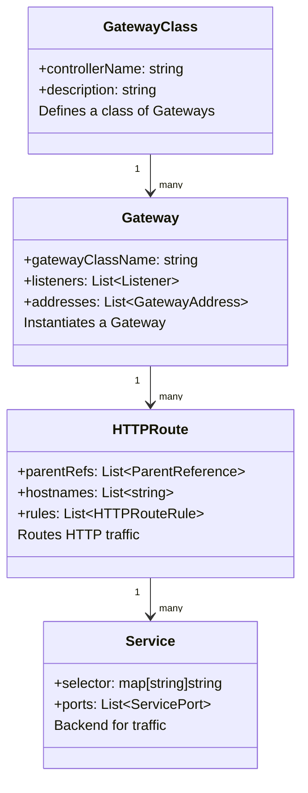
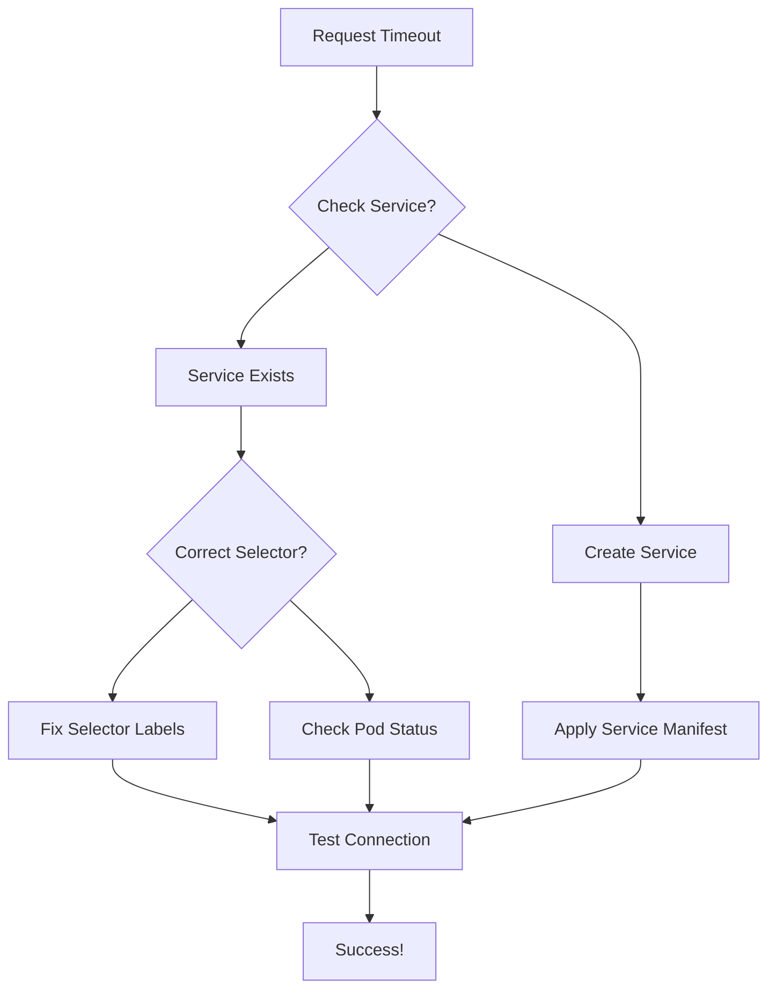
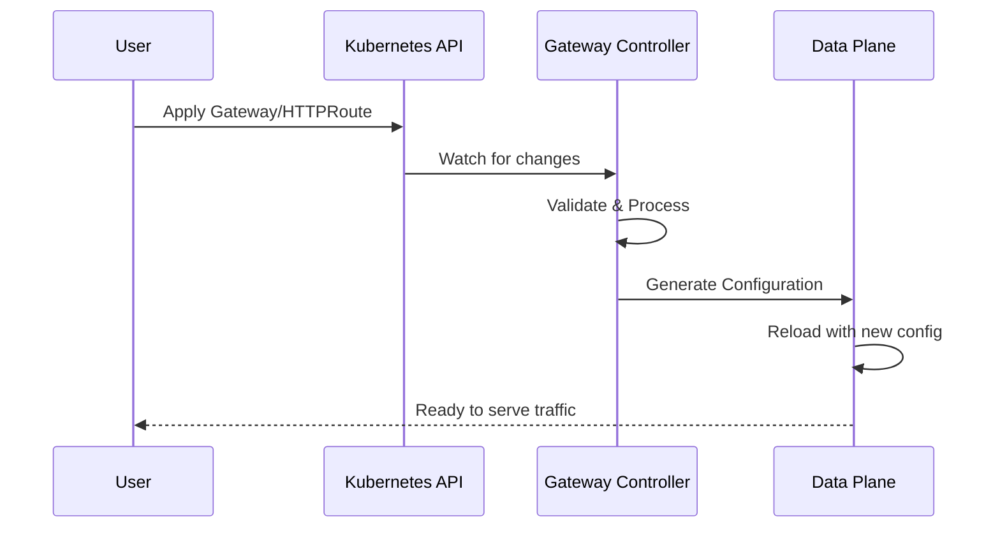
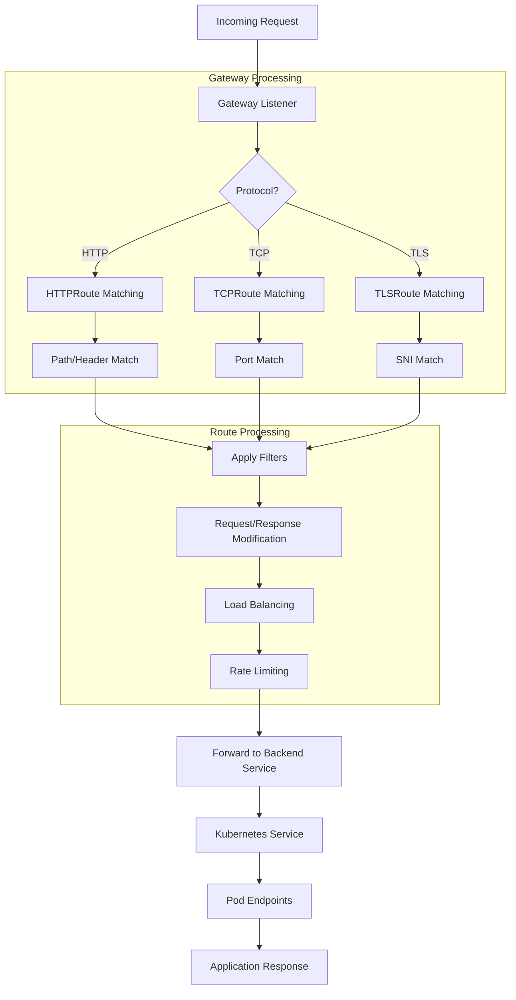
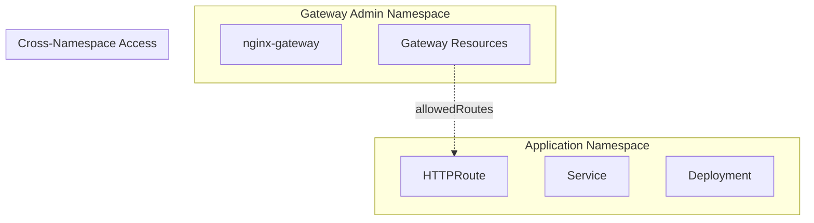

# 🚀 **Kubernetes Traffic Routing Migration: Ingress to Gateway API**

## 📖 **Table of Contents**
- [Overview](#-overview)
- [Architecture Diagrams](#-architecture-diagrams)
- [Prerequisites](#️-prerequisites)
- [Lab Environment Setup](#-lab-environment-setup)
- [Part 1: Traditional Ingress Controller](#-part-1-traditional-ingress-controller)
  - [Installation & Configuration](#installation--configuration)
  - [Common Issues & Fixes](#common-issues--fixes)
- [Part 2: Modern Gateway API](#-part-2-modern-gateway-api)
  - [Gateway API Concepts](#gateway-api-concepts)
  - [Step-by-Step Migration](#step-by-step-migration)
  - [Troubleshooting](#troubleshooting)
- [How It Works Internally](#-how-it-works-internally)
- [Best Practices](#-best-practices)
- [Conclusion](#-conclusion)

---

## 🌟 **Overview**

This project demonstrates a complete migration from the traditional **Kubernetes Ingress API** to the modern **Kubernetes Gateway API** on a self-managed kubeadm cluster deployed on AWS EC2 instances.

### **Why Migrate?**
| Aspect | Ingress API | Gateway API |
|--------|-------------|-------------|
| **API Design** | Single resource, limited expressiveness | Modular, multi-resource, extensible |
| **Multi-tenancy** | Limited namespace support | Built-in, class-based separation |
| **Traffic Management** | Basic routing | Advanced filters, weight-based routing |
| **Protocol Support** | HTTP/HTTPS only | TCP, UDP, TLS, gRPC, WebSocket |
| **Future Proof** | Maintenance mode | Active development, Kubernetes SIG |

---

## 📊 **Architecture Diagrams**

### **1. Traditional Ingress Architecture**



### **2. Modern Gateway API Architecture**



### **3. Request Flow Comparison**



---

## ⚙️ **Prerequisites**

### **Infrastructure Requirements**
```yaml
AWS EC2 Instances:
  - Master Node: t2.medium (2 vCPU, 4GB RAM)
  - Worker Nodes: t2.medium × 2 (2 vCPU, 4GB RAM each)
  - OS: Ubuntu 22.04 LTS
  - Network: Security groups with required ports open
```

### **Software Requirements**
```bash
# On all nodes
kubeadm 1.28+
kubectl 1.28+
containerd 1.7+
calico 3.27+
helm 3.12+ (optional)
```

### **Cluster Health Check**
```bash
# Verify cluster status
kubectl get nodes
kubectl cluster-info
kubectl get pods -A

# Expected output
NAME          STATUS   ROLES           AGE   VERSION
k8s-master    Ready    control-plane   1h    v1.28.0
k8s-worker1   Ready    <none>          1h    v1.28.0
k8s-worker2   Ready    <none>          1h    v1.28.0
```

---

## 🖥️ **Lab Environment Setup**

### **1. Cluster Initialization**
```bash
# Initialize cluster on master
sudo kubeadm init --pod-network-cidr=192.168.0.0/16

# Configure kubectl
mkdir -p $HOME/.kube
sudo cp -i /etc/kubernetes/admin.conf $HOME/.kube/config
sudo chown $(id -u):$(id -g) $HOME/.kube/config

# Install Calico CNI
kubectl create -f https://raw.githubusercontent.com/projectcalico/calico/v3.27.0/manifests/tigera-operator.yaml
kubectl create -f https://raw.githubusercontent.com/projectcalico/calico/v3.27.0/manifests/custom-resources.yaml
```

### **2. Application Deployment**
```yaml
# demo-deployment.yaml
apiVersion: apps/v1
kind: Deployment
metadata:
  name: my-nginx
  namespace: demo
spec:
  replicas: 2
  selector:
    matchLabels:
      app: nginx
  template:
    metadata:
      labels:
        app: nginx
    spec:
      containers:
      - name: nginx
        image: nginx:1.25
        ports:
        - containerPort: 80
---
apiVersion: v1
kind: Service
metadata:
  name: my-nginx
  namespace: demo
spec:
  selector:
    app: nginx
  ports:
  - port: 80
    targetPort: 80
```

---

## 🧱 **Part 1: Traditional Ingress Controller**

### **Installation & Configuration**

#### **Step 1: Deploy NGINX Ingress Controller**
```bash
# Create namespace
kubectl create namespace ingress-nginx

# Deploy with cloud provider manifest
kubectl apply -f https://raw.githubusercontent.com/kubernetes/ingress-nginx/controller-v1.9.0/deploy/static/provider/cloud/deploy.yaml
```

#### **Step 2: Check Deployment Status**
```bash
# Monitor pod creation
kubectl get pods -n ingress-nginx -w

# Expected output
NAME                                        READY   STATUS      RESTARTS   AGE
ingress-nginx-admission-create-xxxxx        0/1     Completed   0          30s
ingress-nginx-admission-patch-xxxxx         0/1     Completed   0          30s
ingress-nginx-controller-xxxxxxxxxx-xxxxx   1/1     Running     0          30s
```

#### **Step 3: Fix Service Type (Cloud vs Bare Metal)**


```bash
# On kubeadm (no cloud load balancer), change to NodePort
kubectl patch svc ingress-nginx-controller \
  -n ingress-nginx \
  -p '{"spec": {"type": "NodePort"}}'

# Get the assigned NodePort
kubectl get svc ingress-nginx-controller -n ingress-nginx -o jsonpath='{.spec.ports[0].nodePort}'
# Output: 31050 (example)
```

### **Common Issues & Fixes**

#### **Issue 1: Admission Webhook Timeout**
```bash
# Error when creating Ingress:
# Error from server (InternalError): failed calling webhook "validate.nginx.ingress.kubernetes.io"
```

**Root Cause**: The admission webhook service endpoint is unreachable.

**Solution**:
```bash
# Temporary fix: Delete the validating webhook
kubectl delete validatingwebhookconfiguration ingress-nginx-admission

# Permanent fix: Check webhook service
kubectl get svc -n ingress-nginx | grep admission
# If missing, reinstall with correct flags
```

#### **Issue 2: EXTERNAL-IP Pending**


**Fix**: Use MetalLB or switch to NodePort.

---

## 🚀 **Part 2: Modern Gateway API**

### **Gateway API Concepts**



### **Step-by-Step Migration**

#### **Step 1: Install Gateway API CRDs**
```bash
# Install the experimental channel (includes HTTPRoute)
kubectl apply -f https://github.com/kubernetes-sigs/gateway-api/releases/download/v1.0.0/experimental-install.yaml

# Verify installation
kubectl get crd | grep gateway
# Expected: gatewayclasses, gateways, httproutes, etc.
```

#### **Step 2: Install NGINX Gateway Controller**
```bash
# Create namespace
kubectl create namespace nginx-gateway

# Deploy NGINX Gateway Controller
kubectl apply -f https://raw.githubusercontent.com/nginxinc/nginx-kubernetes-gateway/v2.0.0/deploy/manifests/nginx-gateway.yaml

# Check deployment
kubectl get all -n nginx-gateway
```

#### **Step 3: Verify GatewayClass Creation**
```bash
# GatewayClass should be created automatically
kubectl get gatewayclass

# Expected output
NAME    CONTROLLER                            AGE
nginx   gateway.nginx.org/nginx-gateway       2m
```

#### **Step 4: Create Gateway Resource**
```yaml
# gateway.yaml
apiVersion: gateway.networking.k8s.io/v1
kind: Gateway
metadata:
  name: web-gateway
  namespace: demo
spec:
  gatewayClassName: nginx
  listeners:
  - name: http
    port: 80
    protocol: HTTP
    allowedRoutes:
      namespaces:
        from: Same
```

#### **Step 5: Create HTTPRoute**
```yaml
# httproute.yaml
apiVersion: gateway.networking.k8s.io/v1
kind: HTTPRoute
metadata:
  name: nginx-route
  namespace: demo
spec:
  parentRefs:
  - name: web-gateway
    namespace: demo
  hostnames:
  - "myapp.local"
  rules:
  - matches:
    - path:
        type: PathPrefix
        value: /
    backendRefs:
    - name: my-nginx
      port: 80
```

#### **Step 6: Expose Gateway Service**
```yaml
# gateway-service.yaml
apiVersion: v1
kind: Service
metadata:
  name: nginx-gateway
  namespace: nginx-gateway
spec:
  type: NodePort
  selector:
    app.kubernetes.io/name: nginx-gateway
  ports:
  - name: http
    port: 80
    targetPort: 80
    nodePort: 32080
```

### **Troubleshooting**

#### **Issue: No Response from Gateway**


**Debug Commands**:
```bash
# Check Gateway status
kubectl describe gateway web-gateway -n demo

# Check HTTPRoute status
kubectl describe httproute nginx-route -n demo

# Check controller logs
kubectl logs -n nginx-gateway deployment/nginx-gateway

# Verify service endpoints
kubectl get endpoints -n nginx-gateway nginx-gateway
```

---

## 🔧 **How It Works Internally**

### **1. Gateway API Control Plane**



### **2. Traffic Processing Flow**



### **3. Configuration Generation**
```bash
# NGINX Gateway Controller generates nginx.conf:
kubectl exec -n nginx-gateway deployment/nginx-gateway -- cat /etc/nginx/nginx.conf

# Sample generated configuration:
server {
    listen 80;
    server_name myapp.local;
    
    location / {
        proxy_pass http://demo_my-nginx_80;
        proxy_set_header Host $host;
    }
}
```

---

## 🏆 **Best Practices**

### **1. Namespace Strategy**


### **2. Security Considerations**
```yaml
# Secure Gateway Configuration
apiVersion: gateway.networking.k8s.io/v1
kind: Gateway
spec:
  listeners:
  - name: https
    port: 443
    protocol: HTTPS
    tls:
      mode: Terminate
      certificateRefs:
      - name: my-cert
    allowedRoutes:
      namespaces:
        from: Selector
        selector:
          matchLabels:
            security-tier: trusted
```

### **3. Monitoring Setup**
```bash
# Enable metrics
kubectl apply -f https://raw.githubusercontent.com/nginxinc/nginx-kubernetes-gateway/main/deploy/manifests/monitoring.yaml

# Access metrics
kubectl port-forward -n nginx-gateway svc/nginx-gateway 9113:9113
curl http://localhost:9113/metrics
```

---

## 📊 **Migration Checklist**

| Task | Status | Notes |
|------|--------|-------|
| ✅ Install Gateway API CRDs | Complete | v1.0.0 experimental |
| ✅ Deploy NGINX Gateway Controller | Complete | v2.0.0 |
| ✅ Create Gateway Resource | Complete | Port 80 listener |
| ✅ Create HTTPRoute | Complete | Host-based routing |
| ✅ Expose Gateway Service | Complete | NodePort 32080 |
| ✅ Test Traffic Flow | Complete | curl with Host header |
| ⬜ Implement TLS | Pending | Need certificates |
| ⬜ Add Monitoring | Pending | Prometheus integration |
| ⬜ Configure WAF Rules | Pending | ModSecurity integration |

---

## 🎯 **Conclusion**

### **Key Takeaways**
1. **Gateway API provides better separation of concerns** between infrastructure and application teams
2. **Modular design enables gradual migration** from Ingress
3. **Advanced routing capabilities** outshine traditional Ingress
4. **Multi-protocol support** future-proofs your infrastructure
5. **Standardized API** reduces vendor lock-in

### **Next Steps**
1. Implement TLS termination with cert-manager
2. Set up comprehensive monitoring with Prometheus/Grafana
3. Explore advanced Gateway API features (TCPRoute, GRPCRoute)
4. Implement canary deployments using weight-based routing
5. Set up multi-cluster Gateway for failover scenarios

### **Production Recommendations**
```yaml
# Production Gateway Configuration
spec:
  gatewayClassName: nginx
  listeners:
  - name: https-main
    port: 443
    protocol: HTTPS
    hostname: "*.example.com"
    tls:
      certificateRefs:
      - name: wildcard-cert
  - name: http-redirect
    port: 80
    protocol: HTTP
    # Redirect all HTTP to HTTPS
```

---

## 📚 **Resources**

- [Kubernetes Gateway API Documentation](https://gateway-api.sigs.k8s.io/)
- [NGINX Gateway Controller GitHub](https://github.com/nginxinc/nginx-kubernetes-gateway)
- [Gateway API Migration Guide](https://gateway-api.sigs.k8s.io/guides/migration/)
- [Kubernetes Ingress vs Gateway API](https://kubernetes.io/blog/2022/07/13/gateway-api-graduates-to-beta/)

---

## 🤝 **Contributing**

Found an issue or have improvements? Feel free to:
1. Open an issue for bugs or feature requests
2. Submit a pull request with improvements
3. Share your migration experiences

---

**Happy Routing!** 🚀

---


---
