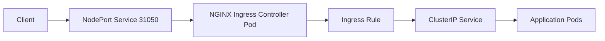
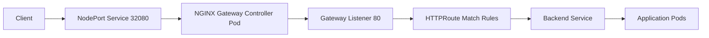
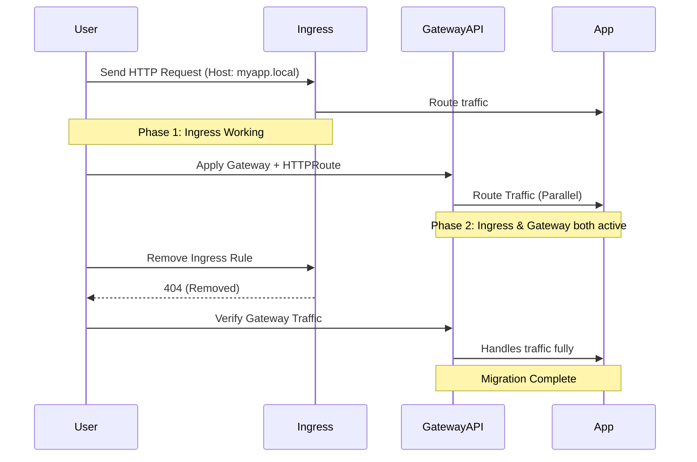
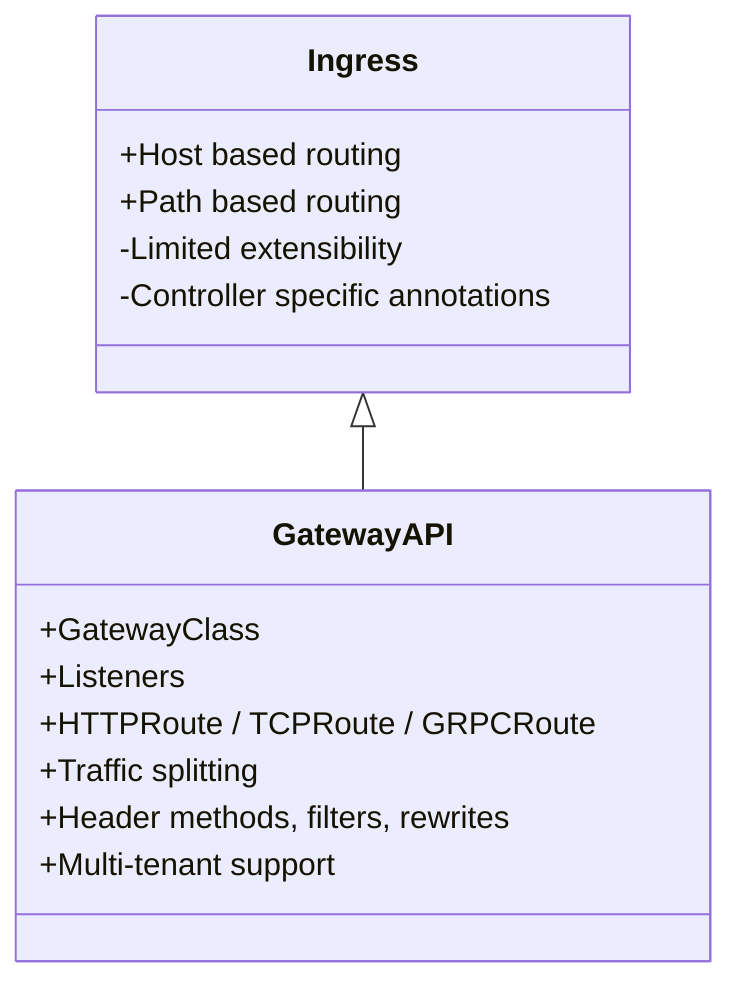
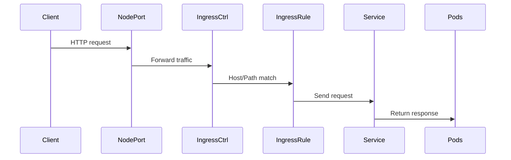
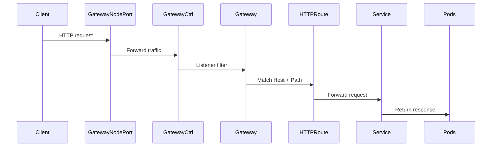
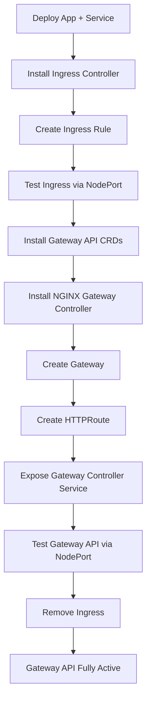
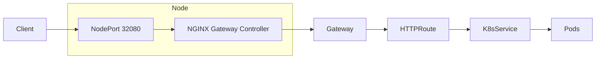

# **Migration from NGINX Ingress Controller → Kubernetes Gateway API (kubeadm Cluster on AWS EC2)**

This repository demonstrates the **complete migration** from **NGINX Ingress** to the modern **Kubernetes Gateway API**, including **real-world errors**, **fixes**, **YAMLs**, and **Mermaid.js architecture diagrams**.

---

# 🚀 Overview

The lab includes:

* Deploying Ingress Controller
* Deploying Gateway API
* Migrating routing
* Handling all real-world issues
* Testing with curl using Host headers
* Exposing gateway controller
* Full architecture diagrams

---

# 📂 Repository Structure

```
k8s-nginx-to-gateway-api-migration/
├── manifests/
├── diagrams/
└── logs/
```

---

# 🧱 **1. Ingress Architecture**



---

# 🧱 **2. Gateway API Architecture**



---

# 🔁 **3. Migration Workflow — Ingress → Gateway API**



---

# 🌐 **4. Difference Between Ingress & Gateway API**



---

# 🔍 **5. Request Flow Comparison**

## Ingress Request Flow



## Gateway API Request Flow



---

# 🧩 **6. Real Errors & Fixes**

## 🔥 Error 1 — Ingress Admission Webhook Timeout

```
failed calling webhook "validate.nginx.ingress.kubernetes.io"
context deadline exceeded
```

### Fix

```
kubectl delete validatingwebhookconfiguration ingress-nginx-admission
```

---

## 🔥 Error 2 — Gateway Controller YAML 404

Cause: Wrong URL — upstream changed folder structure.

### Fix

```
https://raw.githubusercontent.com/nginxinc/nginx-kubernetes-gateway/v1.3.0/deploy/manifests/nginx-gateway.yaml
```

---

## 🔥 Error 3 — GatewayClass is Immutable

Cause: GatewayClass auto-created by controller.

### Fix

Do not create manually — use existing one:

```
kubectl get gatewayclass
```

---

## 🔥 Error 4 — Gateway API not responding

No Service exists in `nginx-gateway` namespace.

### Fix

Create NodePort service:

```yaml
apiVersion: v1
kind: Service
metadata:
  name: nginx-gateway
  namespace: nginx-gateway
spec:
  type: NodePort
  selector:
    app.kubernetes.io/name: nginx-gateway
  ports:
    - port: 80
      nodePort: 32080
```

---

# 🛠 **7. Full Workflow Summary Diagram**



---

# ✔ Final Architecture After Migration



---

# 🎉 **Congratulations**

You now have a **complete, production-grade migration example**, including:

✔ Ingress → Gateway API migration
✔ All manifests
✔ Troubleshooting
✔ Architecture diagrams
✔ Repository structure
✔ Final working environment

